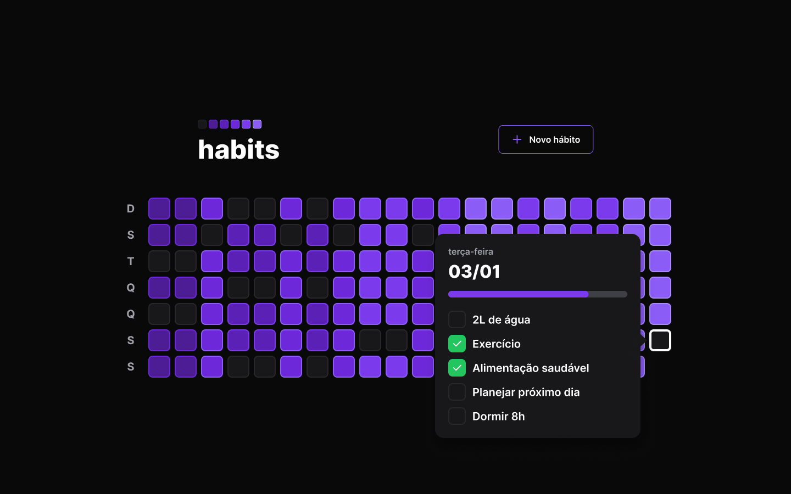
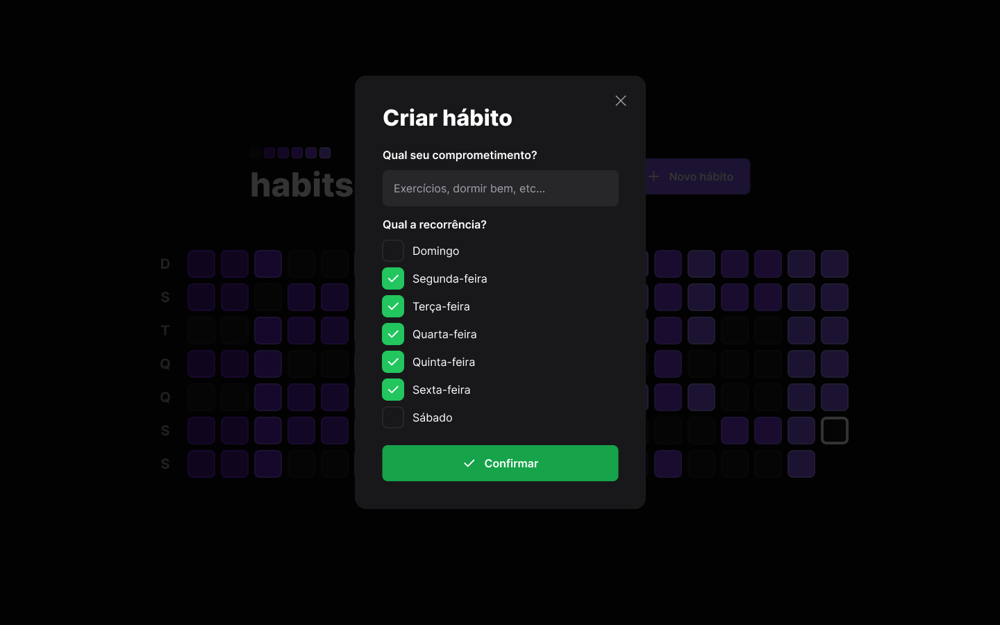
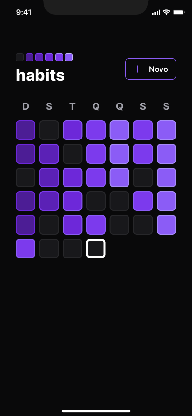

# Habit Tracker

> Aplicativo para Controle de Hábitos

Projeto desenvolvido na Trilha Ignite da 11º edição da NLW (Next Level Week) Setup da [Rocketseat](https://www.rocketseat.com.br/).

## 💻 Projeto

### Web

### Mobile

## 🛠️ Tecnologias

- NodeJS;
- JavaScript;
- Fastify;
- Typescript;
- Prisma;
- ReactJS;
- Tailwind CSS;
- Axios;
- React Native;
- Expo;
- NativeWind.

## 💜 Contato

    
    

